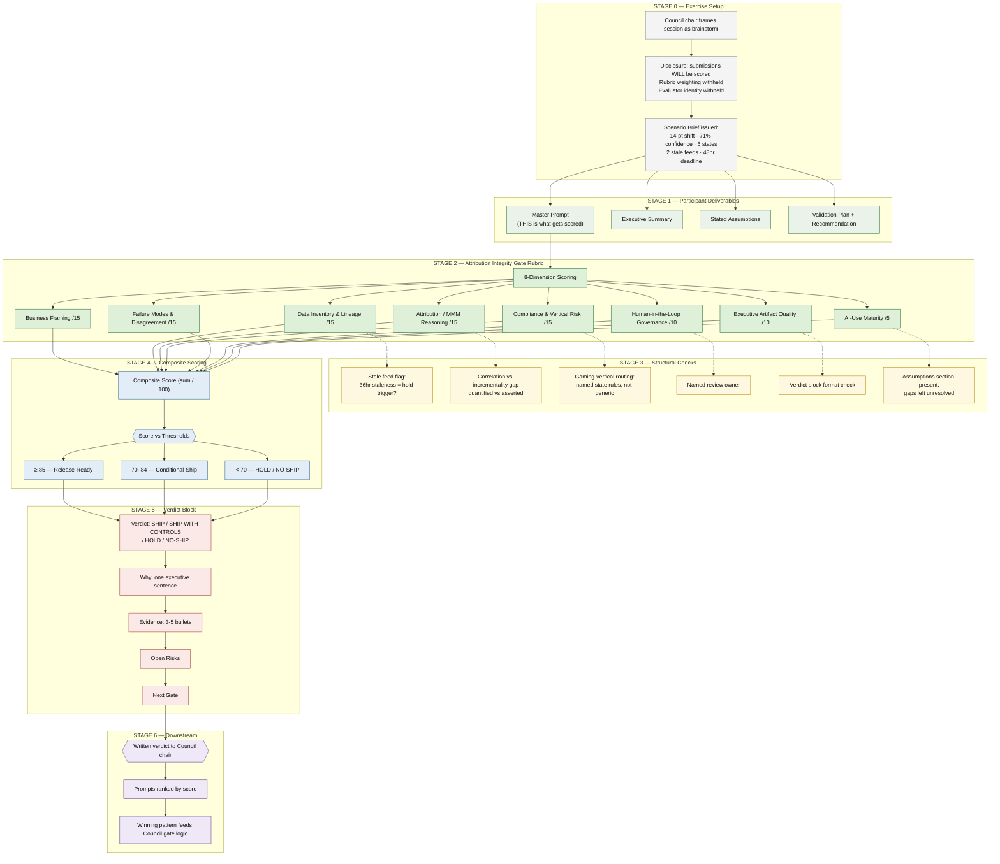

# Attribution Integrity Gate | The Reallocation Call

**Director-level stress-test exercise for AI-influenced media-mix decisions, plus the decision layer that sits above it**


-9cf?style=flat-square)

---

## What this repo is

Two connected pieces of Epoch Frameworks work for performance media agencies running an internal AI Council.

**Chapter 1, the gate.** A director-level stress-test exercise in which participants are not scored on their final answer but on the master prompt they write to reach it. The scenario is a media-mix reallocation where the AI-assisted model and the holdout-based incrementality test disagree. The evaluator is the Attribution Integrity Gate: eight rubric dimensions, one hundred points, a mandatory verdict block.

**Chapter 2, the layer above it.** An AI Council Decision Layer that takes the whole Council backlog, scores every item on five signals, enforces hard caps on what reaches the CEO and President, puts everything else on a cut list with its score, and routes any AI-touched client output through the gate before it moves. Tested against a fully synthetic Council portfolio with 23 planted problems.

Everything in this repo is synthetic. Client names are fictional. No agency, client, employee, or consumer data appears anywhere.

---

## Chapter 1: the exercise

### Scenario

A performance media agency's holdout-based incrementality test disagrees with an AI-assisted media-mix model on a proposed 14-point budget shift for a national sportsbook client (linear TV to CTV and paid social). Confidence on the AI recommendation is 71 percent. Two of six campaign states carry responsible-advertising frequency caps and self-exclusion suppression requirements. Two paid social feeds in the direct-response database are 36 hours stale. The client wants an answer inside 48 hours.

Participants are told plainly that submissions will be scored and a written verdict will return to the Council chair. What is withheld is the rubric weighting and the evaluator's identity.

**What is graded is the master prompt, not the final recommendation.**

### Deliverables per participant

1. Master Prompt (the scored artifact)
2. Executive Summary
3. Stated Assumptions
4. Validation Plan and Final Recommendation

### Scoring rubric, 8 dimensions, 100 points

| Dimension | Points | What it catches |
|---|---|---|
| Business Framing | 15 | Names the decision, the stakeholder, and the 48-hour deadline |
| Data Inventory and Lineage | 15 | Flags the two stale paid social feeds by name and state |
| Attribution / MMM Reasoning | 15 | Quantifies the AI-versus-holdout lift gap instead of asserting it |
| Compliance and Vertical Risk | 15 | Routes to named gaming-vertical state rules, not a generic "make sure it's compliant" |
| Failure Modes and Disagreement | 15 | Resolves the 71-percent-confidence disagreement with an explicit process |
| Human-in-the-Loop Governance | 10 | Names a specific review owner, never "leadership reviews it" |
| Executive Artifact Quality | 10 | Returns the exact mandatory verdict block, not a narrative answer |
| AI-Use Maturity | 5 | States assumptions explicitly rather than silently resolving gaps |

**Thresholds:** 85 and above, Release-Ready (SHIP). 70 to 84, Conditional-Ship with named controls. Below 70, HOLD or NO-SHIP.

### About the 96 / 100

That score is the answer key grading itself, before it was used to grade anyone else. It lost four points on Executive Artifact Quality because the mandatory verdict-block template did not carry through to the export. The gap was flagged, not hidden. No participant submissions or scores are published here.

### Workflow



---

## Chapter 2: the decision layer

The exercise gates one decision. A Council carries dozens, and nearly all of them arrive marked top priority. The AI Council Decision Layer answers the question the gate cannot: which of these reach the executive this week, and why.

### How it works

Every backlog item is scored on five signals, one point each: does it need an executive decision, is there a dated commitment inside 14 days, is someone outside the Council waiting, is other work stuck behind it, is there money attached. Hard caps: three decisions, five risks, five on the watch list. Everything else goes on a cut list with its score. Every line carries an evidence tag (CONFIRMED, OBSERVED, INFERRED); inferred items never enter the executive sections. Any item tied to an AI-touched client output carries the Attribution Integrity Gate verdict for that output.

### The sandbox

`sandbox/AI_Council_Decision_Layer_Sandbox_v1.xlsx` is a fully synthetic Council portfolio: 18 initiatives, a 24-item backlog, a manual deck that has drifted from the system of record, a workstream tracker, a roadmap, dated commitments, a data-feed freshness sheet, and a queue of six AI-touched outputs awaiting a gate verdict. The Chapter 1 scenario is in it as one backlog row under a fictional client. It scores 5, lands as Decision 1, and the gate returns HOLD.

Twenty-three problems are planted: label-versus-score disagreements, missing owners, inferred items, a status field that contradicts its notes, an overdue item with no update, a client-facing guaranteed-lift claim, consumer PII in a notes field, a duplicate, a blank join key, orphans, a ghost, splits between sources, stale records, stale feeds, a model-versus-holdout disagreement, health-vertical copy with no fair-balance check, and activity reported as outcome. An answer key, a gate key, a TRAPS sheet, and a RUN LOG let a run be scored rather than eyeballed.

### Running it blind

Give the runner every sheet except ANSWER KEY, TRAPS, and RUN LOG. Score the run against TRAPS. A prompt version that catches fewer traps than the previous one is a regression, whatever the brief looks like.

---

## What is not in this repo

The answer key for the exercise, the evaluator skill package, and any engagement-specific reference material are held privately. This repository contains the exercise design, the rubric, the decision-layer description, and the synthetic sandbox only.

---

## Repo layout

```
README.md
exercise/
  scenario-brief.md            participant-facing brief, one page
  rubric.md                    8 dimensions, thresholds, verdict block format
sandbox/
  AI_Council_Decision_Layer_Sandbox_v1.xlsx
  how-to-run.md
docs/
  index.html                   landing page
```

---

*Epoch Frameworks LLC | Erwin Maurice McDonald | DACR License v2.6 | All data synthetic*
