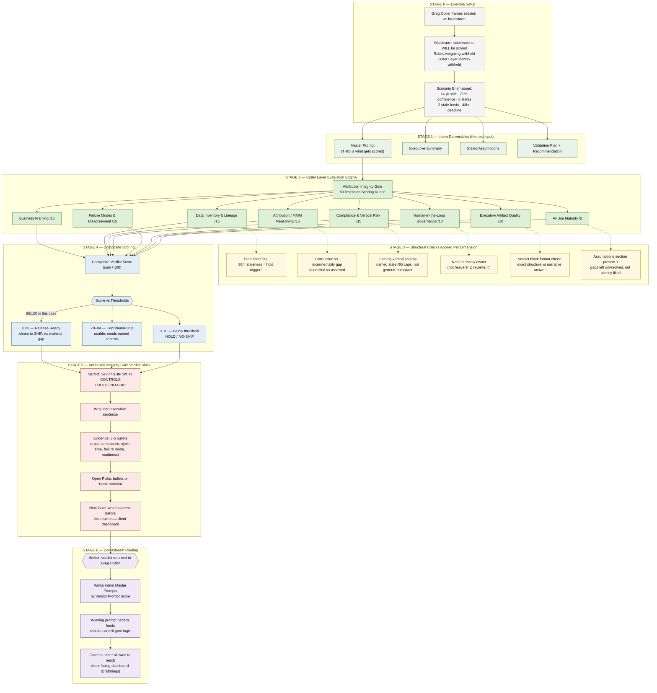

# Cutler Layer | DraftKings Reallocation Call

**Havas Edge Director-Level Stress-Test Exercise — Attribution Integrity Gate**

-9cf?style=flat-square)

---

## Overview

Greg Cutler, VP Analytics at Havas Edge, runs this exercise with the intern class framed as a brainstorming
session — not a test. Before anyone opens a laptop, participants are told plainly that whatever they submit
will be scored against a structured rubric and that a written verdict will return to him. What is withheld is
the rubric weighting itself, and the fact that the exercise runs against the **Cutler Layer** — the same
evaluator used to gate real AI Council output before it reaches a client-facing dashboard.

The scenario: RAMP's holdout-based incrementality test disagrees with an AI-assisted media-mix model's
read on a proposed 14-point budget shift for a DraftKings campaign (linear TV → CTV / paid social).
Confidence on the AI recommendation sits at 71%. Two of six campaign states carry active
responsible-gambling ad frequency caps and self-exclusion suppression requirements. Two paid social
feeds in VantEdge Point are 36 hours stale. The client wants an answer inside 48 hours.

**What's actually graded is not the intern's final answer — it's the master prompt they write to get there.**

---

## Deliverables Required Per Intern

1. Master Prompt *(the scored artifact)*
2. Executive Summary
3. Stated Assumptions
4. Validation Plan + Final Recommendation

---

## Scoring Rubric — 8 Dimensions / 100 Points

| Dimension | Points | What It Catches |
|---|---|---|
| Business Framing | 15 | Names the decision, stakeholder, and 48-hour deadline |
| Data Inventory & Lineage | 15 | Flags the two stale paid social feeds by name and state |
| Attribution / MMM Reasoning | 15 | Quantifies the AI-vs-RAMP lift gap instead of asserting it |
| Compliance & Vertical Risk | 15 | Routes to *named* gaming-vertical state RG rules, not a generic "make sure it's compliant" |
| Failure Modes & Disagreement | 15 | Resolves the 71%-confidence disagreement with an explicit process |
| Human-in-the-Loop Governance | 10 | Names a specific review owner — never "leadership reviews it" |
| Executive Artifact Quality | 10 | Returns the exact mandatory verdict block, not a narrative answer |
| AI-Use Maturity | 5 | States assumptions explicitly rather than silently resolving gaps |

**Thresholds:** ≥85 = Release-Ready (SHIP) · 70–84 = Conditional-Ship (needs named controls) · <70 = HOLD / NO-SHIP

---

## Workflow

---

## Why This Use Case Fits the Skill

- **Puts a real Gate 4 situation in front of a participant** — the AI-vs-RAMP disagreement is the exact
  Failure-Mode Gate the skill names as the strongest scenario to escalate, built out with real numbers.
- **Forces vertical-specific compliance routing** — gaming's responsible-gambling rules replace a generic
  "make sure it's compliant" line, exposing the gap between operator-level and merely competent answers.
- **Exercises all eight rubric dimensions**, not a subset — business framing, data lineage, attribution
  reasoning, compliance, failure-mode handling, human-in-the-loop governance, executive artifact quality,
  and AI-use maturity all have a concrete trigger built into the scenario.
- **Matches the skill's own Exercise Build Pattern** — ambiguous one-page brief, disclosed-but-unweighted
  scoring, four required deliverables, and a scored *prompt* rather than a scored final answer.
- **Diversifies away from the skill's existing worked example** — the reference pharma scenario (Health
  Media Hub / FDA OPDP) already anchors a SHIPS example; testing gaming instead checks whether judgment
  generalizes across verticals rather than pattern-matching to a seen example.
- **Preserves the skill's disclosure requirement by design** — Greg states up front that scoring is
  happening, keeping the exercise inside the skill's disclosed-evaluation rule even with the rubric and the
  Cutler Layer's identity withheld.

---

## Source Documents

- `Master Prompt — The DraftKings Reallocation Call` (Cutler Layer Answer Key — not for participant distribution)
- `Havas Edge Director-Level Stress-Test Exercise — Use Case Brief`
- `Cutler Layer | DraftKings Reallocation — Master Prompt Scorecard` (scoring visualization)

---

*Epoch Frameworks LLC | Prepared for internal use in Havas Edge / Greg Cutler engagement design | Erwin Maurice McDonald | DACR License v2.6*
